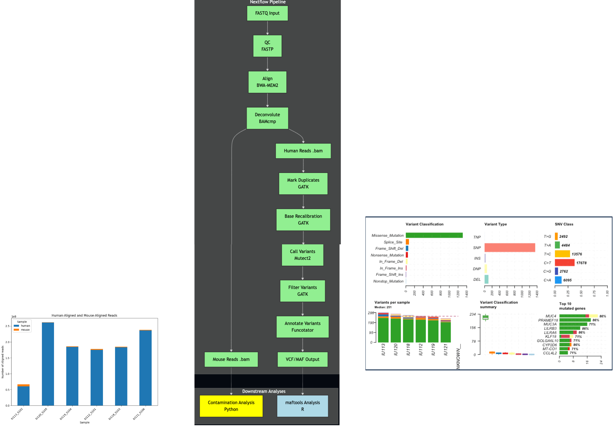
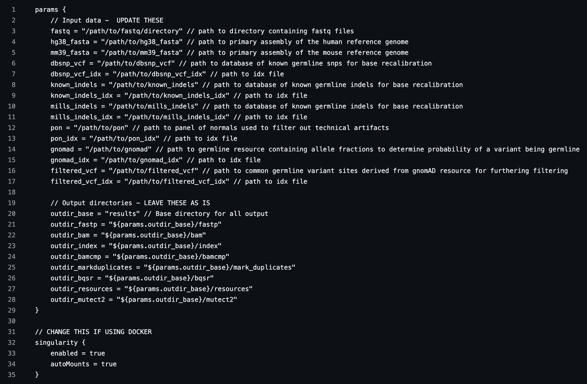
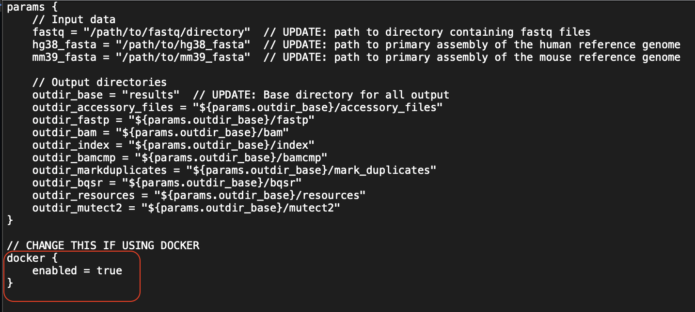

# PDX Somatic Variant Calling Nextflow Pipeline

A Nextflow pipeline specifically designed to perform tumor-only SNP and Indel variant calling from Patient-Derived Xenograft (PDX) models. The pipeline is designed to be easy to implement for HPC users or locally and can be used on whole-genome sequencing (WGS) or whole-exome sequencing (WES) data, as explain in the 'Intervals' section [Getting Set Up](#getting-set-up).

## Table of Contents
1. [Introduction](#introduction)
2. [Pipeline Workflow](#pipeline-workflow)
3. [Pipeline Steps](#pipeline-steps)
4. [Getting Set Up](#getting-set-up)
5. [How to Run Pipeline](#how-to-run-pipeline)
6. [Input](#input)
7. [Pipeline Outputs](#pipeline-outputs)
8. [Downstream Analysis](#optional-downstream-analyses)
9. [Citations](#citations)

## Introduction

**Note**: I have provided hyperlinks to helpful learning materials for concepts introduced throughout this README

This pipeline is built using [Nextflow](https://www.nextflow.io/), a workflow management software that utilizes [containerization](https://www.ibm.com/think/topics/containerization#:~:text=Containerization%20is%20the%20packaging%20of,runs%20consistently%20on%20any%20infrastructure.) to allow for portable and reproducible bioinformatics pipelines.

This pipeline is designed to perform [somatic short variant calling](https://www.garvan.org.au/news-resources/science-explained/types-of-variants) (SNPs Indels) from [patient-derived xenograft (PDX) models](https://en.wikipedia.org/wiki/Patient_derived_xenograft). Specifically, it was built to handle data without a matched-normal sample, which is referred to tumor-only variant calling.

[](https://www.criver.com/products-services/discovery-services/pharmacology-studies/oncology-immuno-oncology-studies/oncology-study-models/patient-derived-xenografts-pdx-models?region=3601)
Source: [Charles River](https://www.criver.com/products-services/discovery-services/pharmacology-studies/oncology-immuno-oncology-studies/oncology-study-models/patient-derived-xenografts-pdx-models?region=3601)

Somatic short variant calling of PDX models without matched-normals is a common task for bioinformaticians. However, it is important to address the unique set of challenges that this task presents, which will be covered shortly.

This pipeline can be conceptually broken down into two main steps:
- Deconvolution (filtering) of mouse reads
- Tumor-only somatic short variant calling of human reads

### Deconvolution of mouse reads
First, it is important to understand that although the tumor is implanted into the mouse, it originated from a human patient and we are interested in these human tumor cells. However, during and after implanation of the tumor into the mouse, there is some degree of infiltration of mouse cells into the tumor, leading to "contamination". As discussed and explored throughly in [Jo et al., 2019](https://link.springer.com/article/10.1186/s13059-019-1849-2), this can lead to false-positive variant calls. This is because mouse reads can align to the human reference genome and be detected as variants. This pipeline utilizes the [bamcmp](https://github.com/CRUKMI-ComputationalBiology/bamcmp) tool, although there are others available to accomplish deconvolution of mouse reads.

### Tumor-only somatic short variant calling
In an ideal world, a matched-normal tissue, which is typically a blood sample or a nearby healthy tissue, is collected from the same patient from which the tumor was extracted. This allows bioinformaticians to identify which variants are present in the tumor and matched-normal tissue and mark these are germline, meaning that they are inherited. The variants from the tumor that are not present in the matched-normal tissue are therefore somatic.

In reality, we often do not have a matched-normal tissue. In the case of PDX models, it can be particularly challenging to retrospectively obtain these matched-normal tissues. The next-best thing is to leverage a database of common germline variants from the general population in place of the matched-normal tissue. If the variants from the tumor are present in this database, we can infer that these variants are germline. This "tumor-only" approach to somatic variant calling should be interpreted with caution, as there is a higher risk for germline variants (particularly rare ones) being called as false-positive somatic variants. This topic is extensively covered in [Haperlin et al., 2017](https://link.springer.com/article/10.1186/s12920-017-0296-8). This pipeline leverages [Mutect2's](https://www.biorxiv.org/content/10.1101/861054v1.abstract) tumor-only mode and follows [GATK's best practices](https://gatk.broadinstitute.org/hc/en-us/articles/360035894731-Somatic-short-variant-discovery-SNVs-Indels)[2]. The output of the pipeline are called variants in VCF and MAF formats.

### Optional downstream analyses
There is also documentation for downstream analyses of the outputs of the nextflow pipeline (see [Downstream Analyses](#downstream-analyses) section)

## Pipeline Workflow



## Pipeline Steps

1. [fastp](https://github.com/OpenGene/fastp) for quality control and adapter trimming
2. [bwa-mem2](https://github.com/bwa-mem2/bwa-mem2) to align trimmed fastq files to both human and mouse reference genomes
3. [bamcmp](https://github.com/CRUKMI-ComputationalBiology/bamcmp) to perform deconvolution of mouse reads
4. [GATK MarkDuplicates](https://gatk.broadinstitute.org/hc/en-us/articles/360037052812-MarkDuplicates-Picard) to identify duplicate reads
5. [GATK BaseRecalibrator](https://gatk.broadinstitute.org/hc/en-us/articles/360036898312-BaseRecalibrator) and [GATK ApplyBQSR](https://gatk.broadinstitute.org/hc/en-us/articles/360037055712-ApplyBQSR) for base quality score recalibration
6. [Mutect2](https://gatk.broadinstitute.org/hc/en-us/articles/360037593851-Mutect2) to call somatic short variants
7. [GATK GetPileupSummaries](https://gatk.broadinstitute.org/hc/en-us/articles/360037593451-GetPileupSummaries), [GATK CalculateContamination](https://gatk.broadinstitute.org/hc/en-us/articles/360036888972-CalculateContamination), and [GATK FilterMutectCalls](https://gatk.broadinstitute.org/hc/en-us/articles/360036856831-FilterMutectCalls) to filter variant calls
8. [Funcotator](https://gatk.broadinstitute.org/hc/en-us/articles/360037224432-Funcotator) to annotate variants and generate .vcf and .maf files

## Getting Set Up

### Clone Repository

To get started with this pipeline, clone the repository to your local machine or HPC environment:

```bash
git clone https://github.com/tylergross97/pdx_somatic_variant_calling.git
cd pdx_somatic_variant_calling
```
### Install software and accessory files
Before running this pipeline, ensure you have the following tools and resources installed. This is the hardest part, but I have provided documentation!

1. Nextflow (version 23.10.0 or later)
   - Installation instructions: [Nextflow Installation Guide](https://www.nextflow.io/docs/latest/getstarted.html)
   - Note that if you are using an HPC system, you may be able to load Nextflow using the [module system](https://hpc-wiki.info/hpc/Modules)

2. Singularity (preferred for HPCs) or Docker
   - Singularity: [Singularity Installation Guide](https://sylabs.io/guides/3.0/user-guide/installation.html)
      - Note that this may already be installed on your HPC system
   - Docker: [Docker Installation Guide](https://docs.docker.com/get-docker/)

3. Reference Genomes:
   - As explained in [Zverinova et al, 2021](https://onlinelibrary.wiley.com/doi/10.1002/humu.24311), we recommend using primary genome assemblies for references
      - Human (hg38)
        ```bash
        curl -O https://42basepairs.com/download/s3/ont-open-data/colo829_2023.04/analysis/sup_wf_som_var/GCA_000001405.15_GRCh38_no_alt_analysis_set.fna
        ```
      - Mouse (mm39 or mm10_nsg)
        - Mouse (mm39)
        ```bash
        curl -O https://ftp.ncbi.nlm.nih.gov/genomes/all/GCF/000/001/635/GCF_000001635.27_GRCm39/GCF_000001635.27_GRCm39_genomic.fna.gz
        gunzip GCF_000001635.27_GRCm39_genomic.fna.gz
         ```
        - Note: If your PDX models utilized NSG (immunocompromised) mice, we recommend using the following NSG-adapted reference genome from [Hynds et al., 2024](https://www.nature.com/articles/s41467-024-47547-3)
           - Use of this reference genome has been shown to improve the filtering of mouse reads when NSG mice are used for the PDX models
             ```bash
             curl -O https://zenodo.org/records/10304175/files/nsg_adapted_reference.zip?download=1
             mv 'nsg_adapted_reference.zip?download=1' nsg_adapted_reference.zip
             unzip nsg_adapted_reference.zip
             cd nsgReference/
             ls
             ```
             - Here you will see the 'mm10.nsgSpike.fa' reference genome that you can specify in your nextflow.config file for params.mm39 instead of the mm39

4. GATK Resource Bundle (for hg38)
   - Download from: [GATK Resource Bundle](https://gatk.broadinstitute.org/hc/en-us/articles/360035890811-Resource-bundle)
      - This contains the accessory files needed for the variant calling portion of the pipeline (e.g., database of common germline variants)
         - Note that some of these files are multiple GBs - this is one of the reasons I personally use an HPC system and not my local computer!
         - You could download the  entire bucket, but not all of the files are needed. I've provided commands to download the necessary files for you below.
         - dbsnp_vcf and dbsnp_vcf_idx: These contain common germline SNPs in vcf format
           - These known variants are to ensure that common variants are not mistaken for sequencing errors and throw off recalibration 
              ```bash
              curl -O https://storage.googleapis.com/genomics-public-data/resources/broad/hg38/v0/Homo_sapiens_assembly38.dbsnp138.vcf
              curl -O https://storage.googleapis.com/genomics-public-data/resources/broad/hg38/v0/Homo_sapiens_assembly38.dbsnp138.vcf.idx
              ```
         - known_indels and known_indels_idx: These contain common germline Indels in vcf format used in base recalibration
            - These known variants are to ensure that common variants are not mistaken for sequencing errors and throw off recalibration 
              ```bash
              curl -O https://storage.googleapis.com/genomics-public-data/resources/broad/hg38/v0/Homo_sapiens_assembly38.known_indels.vcf.gz
              curl -O https://storage.googleapis.com/genomics-public-data/resources/broad/hg38/v0/Homo_sapiens_assembly38.known_indels.vcf.gz.tbi
              ```
         - mills_indels and mills_indels_idx: Another source of common germline indels in vcf format used in base  recalibration
           - These known variants are to ensure that common variants are not mistaken for sequencing errors and throw off recalibration 
              ```bash
              curl -O https://storage.googleapis.com/genomics-public-data/resources/broad/hg38/v0/Mills_and_1000G_gold_standard.indels.hg38.vcf.gz
              curl -O https://storage.googleapis.com/genomics-public-data/resources/broad/hg38/v0/Mills_and_1000G_gold_standard.indels.hg38.vcf.gz.tbi
              ```
           - gnomad and gnomad_idx: Provides germline variants from the Genome Aggregation Database and there allele frequencies needed for Mutect2 to calculate the likelihood of a variant being germline rather than somatic
              - If we had a matched-normal sample, we would use that, but this is important for tumor-only mode
             ```bash
             curl -O https://storage.googleapis.com/gatk-best-practices/somatic-hg38/af-only-gnomad.hg38.vcf.gz
             curl -O https://storage.googleapis.com/gatk-best-practices/somatic-hg38/af-only-gnomad.hg38.vcf.gz.tbi
             ```
         - filtered_vcf and filtered_vcf_idx: Common germline SNPs only (allele frequency > 5%) from the Exome Aggregation Consortium and used as filtering of variants
            ```bash
            curl -O https://storage.googleapis.com/gatk-best-practices/somatic-hg38/small_exac_common_3.hg38.vcf.gz
            curl -O https://storage.googleapis.com/gatk-best-practices/somatic-hg38/small_exac_common_3.hg38.vcf.gz.tbi
            ```
         - pon and pon_idx
           - Panel of normals (PoN) from 1000 Genomes
               - A PoN is used to filter out technical sources of variation and is recommended input for Mutect
               - Because we are looking at technical bias, it is essential that the PoN is generated from a sequencing protocol as similar to the one used to generate your data
                  - Ideally this is from the same capture kit and at the same sequencing facility but if that is not available, the one I have provided is considered a good option as it is considered representative of the general population
            ```bash
            curl -O https://storage.googleapis.com/gatk-best-practices/somatic-hg38/1000g_pon.hg38.vcf.gz
            curl -O https://storage.googleapis.com/gatk-best-practices/somatic-hg38/1000g_pon.hg38.vcf.gz.tbi
            ```
5. Input Data:
   - Paired-end FASTQ files from your PDX samples
      - FASTQ File Naming Convention:
         This pipeline requires a specific naming convention for input FASTQ files. Files should follow this pattern:
         
         *_S*_R{1,2}_001.fastq.gz
         
         Where:
         
         * can be any string (usually sample name or identifier)
         S* represents the sample number (e.g., S1, S2, S3, etc.)
         R{1,2} specifies whether it's the forward (R1) or reverse (R2) read file
         001 is a common suffix in Illumina sequencing output
         Files must be gzipped (.gz extension)
   
         Examples of correctly named files:
         
         Sample1_S1_R1_001.fastq.gz and Sample1_S1_R2_001.fastq.gz
        
         PDX-tumor_S2_R1_001.fastq.gz and PDX-tumor_S2_R2_001.fastq.gz
   
         If your files don't match this naming convention, you may need to rename them before running the pipeline.

6. Intervals
      - The default behavior of this pipeline is to perform variant calling across the entire genome
      - If you have WES data, you may want to provide the capture-kit-specific intervals of the capture site in the form of a BED file
         - The main.intervals.nf is designed to perform variant calling on targeted regions
         - Targeting your analysis to specific intervals improves computational effiency and reduces off-target noise of both base recalibration and variant calling
         - However, it comes with important considerations, as it possible that sequencing outside of the targeted regions occurred and you may miss some important variants - for this reason we pad each genomic interval by 100 base pairs on each side
            - See this [article](https://sites.google.com/a/broadinstitute.org/legacy-gatk-documentation/frequently-asked-questions/4133-When-should-I-use-L-to-pass-in-a-list-of-intervals) for a discussion around this topic
         - If you choose you provide an interval file, you must add its path to your nextflow.config file as a param as shown [here](#adding-intervals) and **run main.intervals.nf instead of main.nf**
            - Here is a command to download the .bed file provided by Illumina for their Illumina Exome 2.5 Panel HG38 genome:
                 ```bash
                 curl -O https://support.illumina.com/content/dam/illumina-support/documents/downloads/productfiles/illumina-prep/exome/hg38_Twist_ILMN_Exome_2.5_Panel_annotated.BED
                 ```
      

7. R (version 4.0 or later) for downstream analysis with maftools
   - Installation instructions: [R Installation Guide](https://cran.r-project.org/) and [maftools](https://www.bioconductor.org/packages/release/bioc/html/maftools.html)

8. Python (version 3.6 or later) for downstream analysis of contamination
   - Installation instructions: [Python Installation Guide](https://www.python.org/downloads/)

### Preparing your [nextflow.config](https://www.nextflow.io/docs/latest/config.html) file

In your cloned repository directory, you have a nextflow.config.template file. All you need to do is copy this file as 'nextflow.config' and edit it to reflect the paths of your accessory files you just downloaded and your fastq files
```bash
cp nextflow.config.template nextflow.config
```
#### Nextflow config template (default)
   
##### Adding Intervals
Make the following changes to the nextflow.config file by specifying the path to your intervals .bed file
   
##### Changing to Docker
Note that the nextflow.config.template file is set up for running Singularity. If using Docker, make the following changes:
   

## How to Run Pipeline

### Running locally

With your nextflow.config and main.nf (or main.intervals.nf) files in your current working directory and nextflow installed, all you need to do is run the following command:

```bash
nextflow run main.nf
```

### Running on SLURM

If you're using a high-performance computing (HPC) cluster that uses SLURM for job scheduling, you can create a [SLURM script](https://www.arch.jhu.edu/short-tutorial-how-to-create-a-slurm-script/) to run the pipeline. It may look something like this:

```bash
#!/bin/bash
#SBATCH --job-name=pdx_pipeline
#SBATCH --nodes=1
#SBATCH --ntasks=1
#SBATCH --cpus-per-task=16
#SBATCH --mem=128G
#SBATCH --time=24:00:00
#SBATCH --output=pdx_pipeline_%j.out
#SBATCH --error=pdx_pipeline_%j.err

# Load Nextflow module (adjust or remove if Nextflow is in your PATH)
module load nextflow

# Set environment variables
export NXF_WORK=$SCRATCH/pdx_work
export SINGULARITY_CACHEDIR=$HOME/singularity_cache
export NXF_SINGULARITY_CACHEDIR=$HOME/nextflow_singularity_cache

# Run the Nextflow pipeline
nextflow run main.nf
```
## Pipeline Outputs

There are many intermediate files generated that will be placed in the results directory you specify in your nextflow.config file. The main files we are interested in are the annotated [.vcf](https://gatk.broadinstitute.org/hc/en-us/articles/360035531692-VCF-Variant-Call-Format) and [.maf](https://docs.gdc.cancer.gov/Data/File_Formats/MAF_Format/) files, saved to the ./results/mutect2/directory. We are particularly interested in the filtered and annotated files. These can be loaded into an R markdown file for analysis with maftools, see [below](#optional-downstream-analyses).

If you are looking to analyze the level of contamination of your original samples, you will need to access the files outputted from bamcmp in the ./results/bamcmp directory

## Downstream analyses

### Contamination Analysis (Python)
Provided is an example of a Python notebook that you can use to visualize contamination present in your original sample. Set the directory variable to ".results/bamcmp/" to run your analysis on the output of the bamcmp process.

Click on image below to view full notebook in .pdf format!
[](images/Contamination_bamcmp.pdf)

### maftools analysis (R)
Provided is an example of an R Markdown file that uses maftools to analyze the filtered.annotated.maf.gz files. These files are output of the final process the pipeline. In the provided example, I was looking to identify mutations in genes known to be implicated in Renal Cell Carcinoma (RCC) for the purpose of genomic characterization of my PDX models.

Click on image below to view full markdown file in .pdf format!
[](images/maftools.pdf)

## Citations

If you use this pipeline in your work, please cite:
[Tyler Gross] (2025). Tumor-Only PDX Somatic Variant Calling Nextflow Pipeline [Computer software]. https://github.com/tylergross97/pdx_somatic_variant_calling

This pipeline is based on the following conceptual frameworks and best practices:
1. Jo, S. Y., Kim, E., & Kim, S. (2019). Impact of mouse contamination in genomic profiling of patient-derived models and best practice for robust analysis. Genome Biology, 20, 1-13.
2. GATK Best Practices for somatic short variant discovery (SNVs + Indels)
   Broad Institute. (2023). Somatic short variant discovery (SNVs + Indels). Retrieved Jan. 2025, from https://gatk.broadinstitute.org/hc/en-us/articles/360035894731-Somatic-short-variant-discovery-SNVs-Indels

This pipeline uses several tools that should be cited independently:

3. Di Tommaso, P., Chatzou, M., Floden, E. W., Barja, P. P., Palumbo, E., & Notredame, C. (2017). Nextflow enables reproducible computational workflows. Nature biotechnology, 35(4), 316-319.
4. Garima Khandelwal, Maria Girotti, Christopher Smowton, Sam Taylor, Chris Wirth, Marek Dynowski, Kris Frese, Ged Brady, Deborah Burt, Richard Marais, Crispin Miller. Next-Gen Sequencing Analysis and Algorithms for PDX and CDX Models. Molecular Cancer Research. 2017, 15:8, PMID: 28442585 DOI: 10.1158/1541-7786.MCR-16-0431
5. Benjamin, D., Sato, T., Cibulskis, K., Getz, G., Stewart, C., & Lichtenstein, L. (2019). Calling somatic SNVs and indels with Mutect2. BioRxiv, 861054.
6. Mayakonda A, Lin D, Assenov Y, Plass C, Koeffler PH (2018). “Maftools: efficient and comprehensive analysis of somatic variants in cancer.” Genome Research. doi:10.1101/gr.239244.118.
7. Chen, S., Zhou, Y., Chen, Y., & Gu, J. (2018). fastp: an ultra-fast all-in-one FASTQ preprocessor. Bioinformatics, 34(17), i884-i890.
8. Li, H. (2013). Aligning sequence reads, clone sequences and assembly contigs with BWA-MEM. arXiv preprint arXiv:1303.3997.
9. Halperin, R. F., Carpten, J. D., Manojlovic, Z., Aldrich, J., Keats, J., Byron, S., ... & Craig, D. W. (2017). A method to reduce ancestry related germline false positives in tumor only somatic variant calling. BMC medical genomics, 10, 1-17.
10. Hynds, R. E., Huebner, A., Pearce, D. R., Hill, M. S., Akarca, A. U., Moore, D. A., ... & Swanton, C. (2024). Representation of genomic intratumor heterogeneity in multi-region non-small cell lung cancer patient-derived xenograft models. Nature communications, 15(1), 4653.

