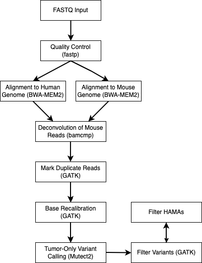

# PDX Somatic Variant Calling Nextflow Pipeline (Tumor-Only)

A Nextflow pipeline specifically designed to perform tumor-only SNP and Indel variant calling from Patient-Derived Xenograft (PDX) models. The pipeline is designed to be easy to implement for HPC users or locally and can be used on whole-genome sequencing (WGS) or whole-exome sequencing (WES) data.

## Table of Contents
1. [Introduction](#introduction)
2. [Pipeline Workflow](#pipeline-workflow)
3. [Pipeline Steps](#pipeline-steps)
4. [Getting Set Up](#getting-set-up)
5. [How to Run Pipeline](#how-to-run-pipeline)
6. [Pipeline Outputs](#pipeline-outputs)
7. [Downstream Analyses](#downstream-analyses)
8. [Planned Updates](#planned-updates)
9. [Citations](#citations)

## Introduction

**Note**: I have provided hyperlinks to helpful learning materials for concepts introduced throughout this README

This pipeline is built using [Nextflow](https://www.nextflow.io/), a workflow management software that utilizes [containerization](https://www.ibm.com/think/topics/containerization#:~:text=Containerization%20is%20the%20packaging%20of,runs%20consistently%20on%20any%20infrastructure.) to allow for portable and reproducible bioinformatics pipelines.

This pipeline is designed to perform [somatic short variant calling](https://www.garvan.org.au/news-resources/science-explained/types-of-variants) (SNPs Indels) from [patient-derived xenograft (PDX) models](https://en.wikipedia.org/wiki/Patient_derived_xenograft). Specifically, it was built to handle data without a matched-normal sample, which is referred to tumor-only variant calling.

[](https://www.criver.com/products-services/discovery-services/pharmacology-studies/oncology-immuno-oncology-studies/oncology-study-models/patient-derived-xenografts-pdx-models?region=3601)
Source: [Charles River](https://www.criver.com/products-services/discovery-services/pharmacology-studies/oncology-immuno-oncology-studies/oncology-study-models/patient-derived-xenografts-pdx-models?region=3601)

Somatic short variant calling of PDX models without matched-normals is a common task for bioinformaticians. However, it is important to address the unique set of challenges that this task presents, which will be covered shortly.

This pipeline can be conceptually broken down into three main parts:
- Deconvolution (filtering) of mouse reads
- Tumor-only somatic short variant calling of human reads
- Lenient blacklisting of human genome-aligned mouse alleles (HAMAs) [1]

### Deconvolution of mouse reads
First, it is important to understand that although the tumor is implanted into the mouse, it originated from a human patient and we are interested in these human tumor cells. However, during and after implanation of the tumor into the mouse, there is some degree of infiltration of mouse cells into the tumor, leading to "contamination". As discussed and explored throughly in [Jo et al., 2019](https://link.springer.com/article/10.1186/s13059-019-1849-2), this can lead to false-positive variant calls. This is because mouse reads can align to the human reference genome and be detected as variants. This pipeline utilizes the [bamcmp](https://github.com/CRUKMI-ComputationalBiology/bamcmp) tool, although there are others available to accomplish deconvolution of mouse reads.

### Tumor-only somatic short variant calling
In an ideal world, a matched-normal tissue, which is typically a blood sample or a nearby healthy tissue, is collected from the same patient from which the tumor was extracted. This allows bioinformaticians to identify which variants are present in the tumor and matched-normal tissue and mark these are germline, meaning that they are inherited. The variants from the tumor that are not present in the matched-normal tissue are therefore somatic.

In reality, we often do not have a matched-normal tissue. In the case of PDX models, it can be particularly challenging to retrospectively obtain these matched-normal tissues. The next-best thing is to leverage a database of common germline variants from the general population in place of the matched-normal tissue. If the variants from the tumor are present in this database, we can infer that these variants are germline. This "tumor-only" approach to somatic variant calling should be interpreted with caution, as there is a higher risk for germline variants (particularly rare ones) being called as false-positive somatic variants. This topic is extensively covered in [Haperlin et al., 2017](https://link.springer.com/article/10.1186/s12920-017-0296-8). This pipeline leverages [Mutect2's](https://www.biorxiv.org/content/10.1101/861054v1.abstract) tumor-only mode and follows [GATK's best practices](https://gatk.broadinstitute.org/hc/en-us/articles/360035894731-Somatic-short-variant-discovery-SNVs-Indels)[2]. The output of the pipeline are called variants in VCF format.

### Lenient blacklisting of human genome-aligned mouse alleles (HAMAs)
As described in Jo et al. (2019), although deconvolution and filtering of mouse reads via a tool such as bamcmp can remove a large number of mouse reads, there is still a risk of false-positive variant calls, particuarly from mouse reads that are alignable to the human genome, known as HAMAs. To be conservative, this pipeline performs lenient blacklisting, by annotating high-risk HAMAs from the VCF file, as recommended by the authors of the paper as a minimum-risk general strategy. See [Pipeline Outputs](#pipeline-outputs) for more details.

## Pipeline Workflow



## Pipeline Steps

1. [fastp](https://github.com/OpenGene/fastp) for quality control and adapter trimming
2. [bwa-mem2](https://github.com/bwa-mem2/bwa-mem2) to align trimmed fastq files to both human and mouse reference genomes
3. [bamcmp](https://github.com/CRUKMI-ComputationalBiology/bamcmp) to perform deconvolution of mouse reads
4. [GATK MarkDuplicates](https://gatk.broadinstitute.org/hc/en-us/articles/360037052812-MarkDuplicates-Picard) to identify duplicate reads
5. [GATK BaseRecalibrator](https://gatk.broadinstitute.org/hc/en-us/articles/360036898312-BaseRecalibrator) and [GATK ApplyBQSR](https://gatk.broadinstitute.org/hc/en-us/articles/360037055712-ApplyBQSR) for base quality score recalibration
6. [Mutect2](https://gatk.broadinstitute.org/hc/en-us/articles/360037593851-Mutect2) to call somatic short variants
7. [GATK GetPileupSummaries](https://gatk.broadinstitute.org/hc/en-us/articles/360037593451-GetPileupSummaries), [GATK CalculateContamination](https://gatk.broadinstitute.org/hc/en-us/articles/360036888972-CalculateContamination), and [GATK FilterMutectCalls](https://gatk.broadinstitute.org/hc/en-us/articles/360036856831-FilterMutectCalls) to filter variant calls
8. [Additional filtering of high-risk human-aligned mouse alleles (HAMAs)](https://pmc.ncbi.nlm.nih.gov/articles/PMC6844030/#Fig4)

## Getting Set Up

### Clone Repository

To get started with this pipeline, clone the repository to your local machine or HPC environment:

```bash
git clone https://github.com/tylergross97/pdx_somatic_variant_calling.git
cd pdx_somatic_variant_calling
```
### Install software and accessory files
Before running this pipeline, ensure you have the following tools and resources installed. This is the hardest part, but I have provided documentation!

1. Nextflow (version 23.10.0 or later)
   - Installation instructions: [Nextflow Installation Guide](https://www.nextflow.io/docs/latest/getstarted.html)
   - Note that if you are using an HPC system, you may be able to load Nextflow using the [module system](https://hpc-wiki.info/hpc/Modules)

2. Singularity (preferred for HPCs) or Docker
   - Singularity: [Singularity Installation Guide](https://sylabs.io/guides/3.0/user-guide/installation.html)
      - Note that this may already be installed on your HPC system
   - Docker: [Docker Installation Guide](https://docs.docker.com/get-docker/)

3. Reference Genomes:
   - As explained in [Zverinova et al, 2021](https://onlinelibrary.wiley.com/doi/10.1002/humu.24311), we recommend using primary genome assemblies for references
      - Human (hg38)
        ```bash
        curl -O https://42basepairs.com/download/s3/ont-open-data/colo829_2023.04/analysis/sup_wf_som_var/GCA_000001405.15_GRCh38_no_alt_analysis_set.fna
        ```
      - Mouse (mm39 or mm10_nsg)
        - General: mouse (mm39)
        ```bash
        curl -O https://ftp.ncbi.nlm.nih.gov/genomes/all/GCF/000/001/635/GCF_000001635.27_GRCm39/GCF_000001635.27_GRCm39_genomic.fna.gz
        gunzip GCF_000001635.27_GRCm39_genomic.fna.gz
         ```
        - If your PDX models utilized NSG (immunocompromised) mice, we recommend using the following NSG-adapted reference genome from [Hynds et al., 2024](https://www.nature.com/articles/s41467-024-47547-3)
           - Use of this reference genome has been shown to improve the filtering of mouse reads when NSG mice are used for the PDX models
             ```bash
             curl -O https://zenodo.org/records/10304175/files/nsg_adapted_reference.zip?download=1
             mv 'nsg_adapted_reference.zip?download=1' nsg_adapted_reference.zip
             unzip nsg_adapted_reference.zip
             cd nsgReference/
             ls
             ```
             - Here you will see the 'mm10.nsgSpike.fa' reference genome that you can specify in your nextflow.config file for params.mm39_fasta instead of the unmodified mouse reference genome

4. GATK Resource Bundle (accessory files)
   - The required accessory files are automatically downloaded from [GATK Resource Bundle](https://gatk.broadinstitute.org/hc/en-us/articles/360035890811-Resource-bundle) at the beginning of the pipeline
         - Note that some of these files are multiple GBs - this is one of the reasons I personally use an HPC system and not my local computer!
         - I've provided some details on the accessory files for you [here](images/accessory_files.pdf)
5. FASTQ files:
   - Paired-end FASTQ files from your PDX samples
      - FASTQ File Naming Convention:
         This pipeline requires a specific naming convention for input FASTQ files. Files should follow this pattern:
         
         *_S*_R{1,2}_001.fastq.gz
         
         Where:
         
         * can be any string (usually sample name or identifier)
         S* represents the sample number (e.g., S1, S2, S3, etc.)
         R{1,2} specifies whether it's the forward (R1) or reverse (R2) read file
         001 is a common suffix in Illumina sequencing output
         Files must be gzipped (.gz extension)
   
         Examples of correctly named files:
         
         Sample1_S1_R1_001.fastq.gz and Sample1_S1_R2_001.fastq.gz
        
         PDX-tumor_S2_R1_001.fastq.gz and PDX-tumor_S2_R2_001.fastq.gz
   
         If your files don't match this naming convention, you may need to rename them before running the pipeline.

6. Intervals.bed file (for WES data)
      - The default behavior of this pipeline is to perform variant calling across the entire genome (main.nf)
      - If you have WES data, you may want to provide the capture-kit-specific intervals of the capture site in the form of a BED file
         - If params.intervals is provided in your nextflow.config file, variant calling will be performed only on these targeted regions
         - Targeting your analysis to specific intervals improves computational effiency and reduces off-target noise of both base recalibration and variant calling
         - However, it comes with important considerations, as it possible that sequencing outside of the targeted regions occurred and you may miss some important variants - for this reason we pad each genomic interval by 100 base pairs on each side
            - See this [article](https://sites.google.com/a/broadinstitute.org/legacy-gatk-documentation/frequently-asked-questions/4133-When-should-I-use-L-to-pass-in-a-list-of-intervals) for a discussion around this topic
         - If you choose you provide an interval file, you must add its path to your nextflow.config file as a param as shown [here](#adding-intervals)
            - Here is a command to download the .bed file provided by Illumina for their Illumina Exome 2.5 Panel HG38 genome:
                 ```bash
                 curl -O https://support.illumina.com/content/dam/illumina-support/documents/downloads/productfiles/illumina-prep/exome/hg38_Twist_ILMN_Exome_2.5_Panel_annotated.BED
                 ```
      

7. Python (version 3.6 or later) for downstream analysis of contamination
   - Installation instructions: [Python Installation Guide](https://www.python.org/downloads/)

### Preparing your [nextflow.config](https://www.nextflow.io/docs/latest/config.html) file

In your cloned repository directory, you have a nextflow.config.template file. All you need to do is copy this file as 'nextflow.config' and edit it to reflect the paths of your accessory files you just downloaded and your fastq files
```bash
cp nextflow.config.template nextflow.config
```
##### Adding Intervals
If you have WES data, you can add the following param to your nextflow.config file and specify its path
   
##### Profiles
To run with singularity (recommended for HPC) specify with the '-profile singularity' command line tag
To run with Docker specify with the '-profile docker' command line tag

## How to Run Pipeline

### Running locally

With your nextflow.config and main.nf (or main.intervals.nf) files in your current working directory and nextflow installed, all you need to do is run the following command for genome-wide variant calling:

```bash
nextflow run main.nf
```
### Running on SLURM

If you're using a high-performance computing (HPC) cluster that uses SLURM for job scheduling, you can create a [SLURM script](https://www.arch.jhu.edu/short-tutorial-how-to-create-a-slurm-script/) to run the pipeline. It may look something like this:

```bash
#!/bin/bash
#SBATCH --job-name=pdx_pipeline
#SBATCH --nodes=1
#SBATCH --ntasks=1
#SBATCH --cpus-per-task=16
#SBATCH --mem=128G
#SBATCH --time=24:00:00
#SBATCH --output=pdx_pipeline_%j.out
#SBATCH --error=pdx_pipeline_%j.err

# Load Nextflow module (adjust or remove if Nextflow is in your PATH)
module load nextflow

# Set environment variables
export NXF_WORK=$SCRATCH/pdx_work
export SINGULARITY_CACHEDIR=$HOME/singularity_cache
export NXF_SINGULARITY_CACHEDIR=$HOME/nextflow_singularity_cache

# Run the Nextflow pipeline
nextflow run main.nf
```
## Pipeline Outputs

There are many intermediate files generated that will be placed in the results directory you specify in your nextflow.config file. The main file we are interested are the {sample}.filtered.hama_annotated.vcf.gz [.vcf](https://gatk.broadinstitute.org/hc/en-us/articles/360035531692-VCF-Variant-Call-Format) file, saved to the ./results/mutect2/directory.

These files are your original filtered VCFs with an additional annotation column HAMA_ID in the INFO field.

HAMA_ID shows which variants fall into known high-risk HAMA regions from Jo et al. (2019).

If a variant's HAMA_ID is '.', it means the variant does NOT overlap any known HAMA high-risk region. This is likely going to the case for the majority of variants.

```
 bcftools query -f '%CHROM\t%POS\t%REF\t%ALT\t%INFO/HAMA_ID\n' IU112_S101.filtered.hama_annotated.vcf.gz | head
chr1	15211	T	G	.
chr1	16682	G	A	.
chr1	16688	G	A	.
chr1	16737	G	T	.
chr1	16742	G	C	.
chr1	30923	G	T	.
chr1	70210	ATG	A	.
chr1	70215	T	G	.
chr1	126108	G	A	.
chr1	126113	C	A	.
```

If a variant's HAMA_ID has a string ID, that ID corresponds to the BED region that variant overlaps. We can specifically query the variants that are present in the high-risk HAMA list (and therefore likely false positives) with the following command:

```
bcftools view -i 'INFO/HAMA_ID!="."' IU112_S101.filtered.hama_annotated.vcf.gz | \
bcftools query -f '%CHROM\t%POS\t%REF\t%ALT\t%INFO/HAMA_ID\n'
chr1	15970045	C	A	chr1_15970045_T_C
chr1	53676194	C	A	chr1_53676194_C_T
chr1	160267367	CTTTTT	C	chr1_160267371_T_C
chr1	201868806	CGT	C	chr1_201868806_A_G
chr2	74474361	CG	TT	chr2_74474362_T_C
chr2	74474365	A	G	chr2_74474365_G_A
.
.
.
```

## Downstream analyses

### Contamination Analysis (Python)
Provided is an example of a Python script that you can use to visualize contamination present in your original sample. Set the directory variable to ".results/bamcmp/" to run your analysis on the output of the bamcmp process.

[Python script](scripts/contamination_bamcmp.py)


## Testing

Must have nf-test installed in your environment

### Generation of test datasets

Create and activate conda environment:
```bash
# 1. Create a new environment
conda create -n wgsim_env -c bioconda -c conda-forge wgsim

# 2. Activate the environment
conda activate wgsim_env

# 3. Verify installation
wgsim -h
```
Create two synthetic PDX samples - one with 10% mouse contamination (pdx90_S1) and one with 30% mouse contamination (pdx70_S2)

From project directory, run:

```bash
./scripts/simulate_pdx_reads.sh
```

There's some testing reference files that are too large to host on github. I am exploring options for hosting these in a google bucket, but in the meantime, they can be created in the following ways:
- Reference genomes (hg38_chr22.fa and mm39_chr19.fa)
```bash
mkdir -p tests/data/references
curl -L -o tests/data/references/hg38_chr22.fa https://zenodo.org/record/3901966/files/hg38_chr22.fa
curl -L -o tests/data/references/mm39_chr19.fa https://zenodo.org/record/3901966/files/mm39_chr19.fa
```
- Index files for each reference must be created by running nf-test test tests/modules/index_human.nf.test and nf-test test tests/modules/index_mouse.nf.test and then copying the created index files from the respective .nf-test work directory into tests/data/alignment_input/index_human/ and tests/data/alignment_input/index_mouse/, respectively

- After running fastp.nf.test, outputs from the work dirs should be copied to tests/data/fastp_output


## Planned Updates
- The following changes are expected to made (in no particular order) to increase usability and improve analysis in the near future. Collaboration is welcome!
   - Providing additionality functionality for those with a matched-normal sample:
      - Using this to filter germline variants
   - Providing additional functionality for those with the original patient tumor sample:
      - Quantifying the degree of similarity between the PDX sample and the original patient sample
   - Perform somatic copy number analysis
   - Add public dataset for users to test the pipeline on
   - Allow for a sample sheet for input files
   - Benchmarking Pipeline  
## Citations

If you use this pipeline in your work, please cite:
[Tyler Gross] (2025). Tumor-Only PDX Somatic Variant Calling with Nextflow [Computer software]. https://github.com/tylergross97/pdx_somatic_variant_calling

This pipeline is based on the following conceptual frameworks and best practices:
1. Jo, S. Y., Kim, E., & Kim, S. (2019). Impact of mouse contamination in genomic profiling of patient-derived models and best practice for robust analysis. Genome Biology, 20, 1-13.
2. GATK Best Practices for somatic short variant discovery (SNVs + Indels)
   Broad Institute. (2023). Somatic short variant discovery (SNVs + Indels). Retrieved Jan. 2025, from https://gatk.broadinstitute.org/hc/en-us/articles/360035894731-Somatic-short-variant-discovery-SNVs-Indels

This pipeline uses several tools that should be cited independently:

3. Di Tommaso, P., Chatzou, M., Floden, E. W., Barja, P. P., Palumbo, E., & Notredame, C. (2017). Nextflow enables reproducible computational workflows. Nature biotechnology, 35(4), 316-319.
4. Garima Khandelwal, Maria Girotti, Christopher Smowton, Sam Taylor, Chris Wirth, Marek Dynowski, Kris Frese, Ged Brady, Deborah Burt, Richard Marais, Crispin Miller. Next-Gen Sequencing Analysis and Algorithms for PDX and CDX Models. Molecular Cancer Research. 2017, 15:8, PMID: 28442585 DOI: 10.1158/1541-7786.MCR-16-0431
5. Benjamin, D., Sato, T., Cibulskis, K., Getz, G., Stewart, C., & Lichtenstein, L. (2019). Calling somatic SNVs and indels with Mutect2. BioRxiv, 861054.
6. Mayakonda A, Lin D, Assenov Y, Plass C, Koeffler PH (2018). “Maftools: efficient and comprehensive analysis of somatic variants in cancer.” Genome Research. doi:10.1101/gr.239244.118.
7. Chen, S., Zhou, Y., Chen, Y., & Gu, J. (2018). fastp: an ultra-fast all-in-one FASTQ preprocessor. Bioinformatics, 34(17), i884-i890.
8. Li, H. (2013). Aligning sequence reads, clone sequences and assembly contigs with BWA-MEM. arXiv preprint arXiv:1303.3997.
9. Halperin, R. F., Carpten, J. D., Manojlovic, Z., Aldrich, J., Keats, J., Byron, S., ... & Craig, D. W. (2017). A method to reduce ancestry related germline false positives in tumor only somatic variant calling. BMC medical genomics, 10, 1-17.
10. Hynds, R. E., Huebner, A., Pearce, D. R., Hill, M. S., Akarca, A. U., Moore, D. A., ... & Swanton, C. (2024). Representation of genomic intratumor heterogeneity in multi-region non-small cell lung cancer patient-derived xenograft models. Nature communications, 15(1), 4653.

